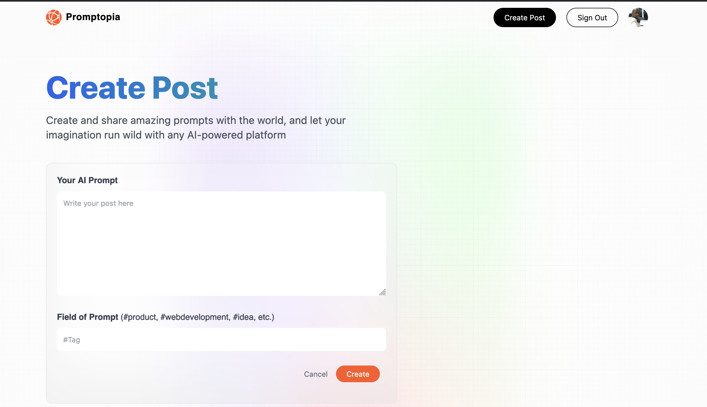

# Next.js 13 Full Course 2023 | Build and Deploy a Full Stack App Using the Official React Framework

# Introduction

Next.js recently became the official React framework as outlined in React docs. In this course, you'll learn the most important Next.js concepts and how they fit into the React ecosystem. Finally, you'll put your skills to the test by building a modern full-stack Next 13 application.

💻 Screen shot 💻

In this App 🚚 :

1. Next.js 13 App Folder Structure
2. Next.js 13 Client Components vs Server Components
3. Next.js 13 File-based Routing (including dynamic and nested routes)
4. Next.js 13 page, layout, loading, and error Special Files
5. Next.js 13 Serverless Route Handlers (Next API, Full Stack Apps)
6. Next.js 13 Metadata and Search Engine Optimization (SEO)
7. Three ways to fetch data in Next.js:
   - Server Side Rendering (SSR),
   - Static Site Generation (SSG),
   - Incremental Static Generation (ISR),
